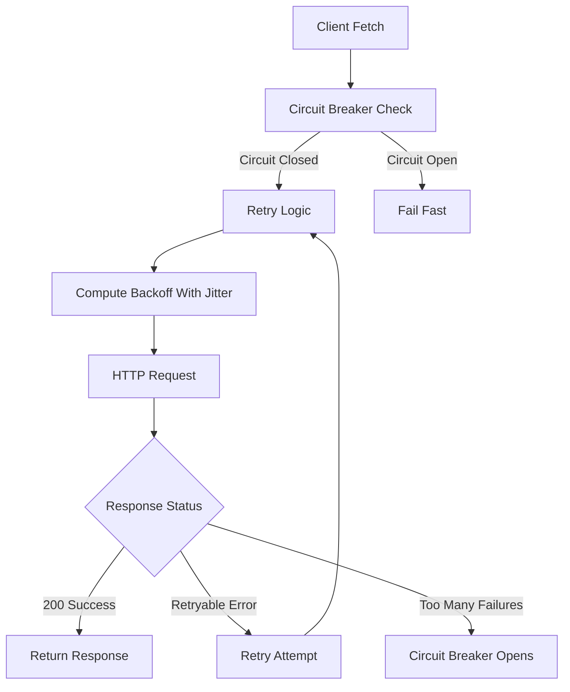
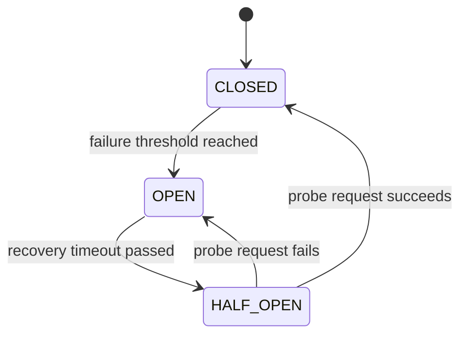
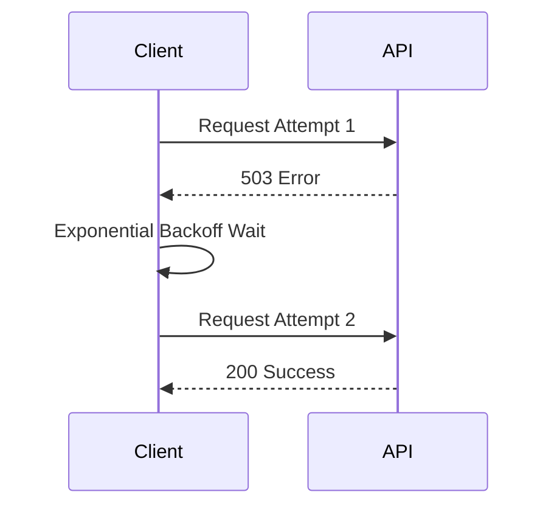

Python • Resilience Patterns • Circuit Breaker • Exponential Backoff • Observability


A production-grade resilient HTTP client for Python implementing exponential backoff with jitter, circuit breaking, intelligent rate limit handling, and structured observability.

---

# RetryableAPIClient

A production-grade resilient HTTP client for Python implementing exponential backoff with jitter, circuit breaking, intelligent rate limit handling, and structured observability.

Built from scratch to understand — not just use — the resilience patterns that power systems at Stripe, Netflix, and AWS.

---

# The Problem This Solves

Every service that calls external APIs faces the same failure modes:

* A downstream service responds slowly — your threads pile up and your service dies, not because your code is broken but because you were too polite to hang up
* A transient network error fails a request that would have succeeded on the second attempt
* A struggling server gets hammered by simultaneous retries from every client — the thundering herd makes recovery impossible
* A dependency goes down completely — without protection, every request to your service hangs waiting for a response that will never come

This client solves all four problems with layered defenses:

**timeout → retry → backoff with jitter → circuit breaking → structured observability**

---

# Architecture

```
retryable_caller/
├── config.py
├── logger.py
├── backoff.py
├── circuit_breaker.py
├── caller.py
└── main.py
```

---

# Request Flow



---

# Circuit Breaker State Machine



---

# Retry Timeline Example



---

# Components

**config.py** — Single Config dataclass holding all tunable parameters.
No magic numbers anywhere in the codebase. Every value has a name and a reason.

**logger.py** — JSONFormatter producing structured logs consumable directly by Datadog, ELK Stack, and Splunk. Every log line carries a correlation ID, timestamp, response time in milliseconds, and status code.

**backoff.py** — Exponential backoff with full jitter. Implements the strategy validated by AWS research as optimal under load — randomizing wait time prevents thundering herd on recovery.

**circuit_breaker.py** — Three-state machine.

* CLOSED under normal operation
* OPEN after failure threshold — fails fast without calling dependency
* HALF-OPEN after cooldown — tests recovery with a probe request

**caller.py** — RetryableAPIClient exposes a single `fetch()` method.
Facade pattern hiding all resilience complexity from the caller.

Handles:

* retries
* backoff
* circuit breaking
* rate limit handling

---

# Installation

```bash
git clone https://github.com/ShubhamCodeWiz/resilient-api-client
cd resilient-api-client
pip install httpx
```

---

# Usage

```python
from retryable_caller.caller import RetryableAPIClient
from retryable_caller.config import Config

config = Config(
    max_retries=3,
    base_delay=1.0,
    max_delay=30.0,
    connect_timeout=3.0,
    read_timeout=10.0,
    failure_threshold=5,
    recovery_timeout=30.0
)

client = RetryableAPIClient(config)

response = client.fetch("https://api.example.com/data")
```

---

# Example Output

A single request that hits a 503, retries with backoff, and succeeds on the second attempt:

```json
{"timestamp": "2024-01-15T14:23:01.123Z", "level": "INFO",
 "correlation_id": "7f3a9b2c", "event": "api_call_attempt",
 "attempt": 1, "url": "https://api.example.com/data",
 "status_code": 503, "response_time_ms": 142}

{"timestamp": "2024-01-15T14:23:03.891Z", "level": "WARNING",
 "correlation_id": "7f3a9b2c", "event": "retry_attempt",
 "attempt": 2, "backoff_ms": 2743,
 "reason": "status_503_retryable"}

{"timestamp": "2024-01-15T14:23:06.634Z", "level": "INFO",
 "correlation_id": "7f3a9b2c", "event": "api_call_success",
 "attempt": 2, "url": "https://api.example.com/data",
 "status_code": 200, "response_time_ms": 98}
```

---

# Design Decisions

This section explains the **why behind each technical choice**.

### Why exponential backoff instead of fixed delay?

Fixed delay means all retries hit the server at predictable intervals.
Exponential backoff creates increasing breathing room for the server to recover.

---

### Why full jitter?

Without jitter, clients retry at the same time — causing a thundering herd.
AWS research showed full jitter performs best under heavy load.

---

### Why separate connect_timeout and read_timeout?

They protect against different failures:

Connection timeout → network failures
Read timeout → slow server responses

---

### Why idempotency checks?

Retrying POST requests blindly can create duplicate resources or double charge users.

Idempotency keys ensure retries are safe.

---

### Why the Facade pattern?

Business logic should simply call:

```
fetch()
```

It should not know about:

* retry logic
* circuit breakers
* backoff strategies

This keeps the system loosely coupled.

---

### Why structured JSON logs?

Plain text logs cannot be queried efficiently.

JSON logs allow structured search in:

* Datadog
* ELK Stack
* Splunk

---

### Why correlation IDs?

They link logs across multiple services.

Without them, reconstructing request flows in distributed systems is extremely difficult.

---

# What I Would Add Next

**Prometheus metrics**

Counters for:

* total requests
* retries
* circuit breaker openings
* response time histograms

---

**Fallback responses**

Return cached data when the circuit breaker is OPEN.

---

**Full test suite**

Using:

* pytest
* respx for HTTP mocking

---

**OpenTelemetry integration**

Replace correlation IDs with OpenTelemetry trace context for distributed tracing.
